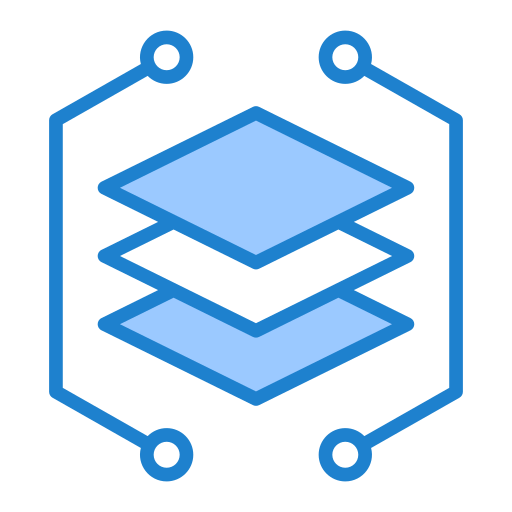

<div align="center">
  
</div>

<div align="center">
  <h4><em>🧪 An alchemist of late nights, turning AI and ML into real-time web apps, and bugs into unplanned, surprise features</em></h4>
</div>

##  About Me

<table>
<tr>
<td width="50%">

### 🚀 Professional Focus

I'm a **lifelong learner** with a passion for the **alchemy of web development** and **artificial intelligence**. My mission is transforming abstract concepts into **real-time, data-driven applications**.

**Core Philosophy:**

- 🏗️ Clean architectures & scalable systems
- 🎨 Intuitive user interfaces
- 📊 Data-driven decision making
- 🌙 Turning late nights into breakthroughs

</td>
<td width="50%">

### 🎯 Current Journey

<div align="center">

**🔭 Exploring**

```
→ Scalable AI Architectures
→ Real-time Web Ecosystems
→ Cloud-native Development
```

**🤝 Open to Collaborate**

```
→ Open-Sourced Projects
→ AI-driven Solutions
→ Intelligent Backend Systems
→ Interactive Data Dashboards
```

</div>

</td>
</tr>
</table>

<br/>

<br/>

##  Tech Stack & Tools

<div align="center">

### 🎨 Frontend Development


### ⚙️ Backend Development


### 🗄️ Database & Storage


### 🤖 AI/ML & Data Science


### ☁️ DevOps & Cloud


</div>

<br/>

<br/>

## 🤝 Connect & Collaborate

<div align="center">
  
### 💬 Let's Build Something Amazing Together!

<a href="https://notansh.is-a.dev" target="_blank" rel="noopener noreferrer">
  
</a>
<a href="https://github.com/Garvaansh" target="_blank" rel="noopener noreferrer">
  
</a>
<a href="https://www.linkedin.com/in/garvaansh-gupta-176358340" target="_blank" rel="noopener noreferrer">
  
</a>
<a href="https://discord.com/users/980746832005189702" target="_blank" rel="noopener noreferrer">
  
</a>

<br/>

---

<h3 align="left">PS:</h3>

<div align="center">

</div>

</div>
